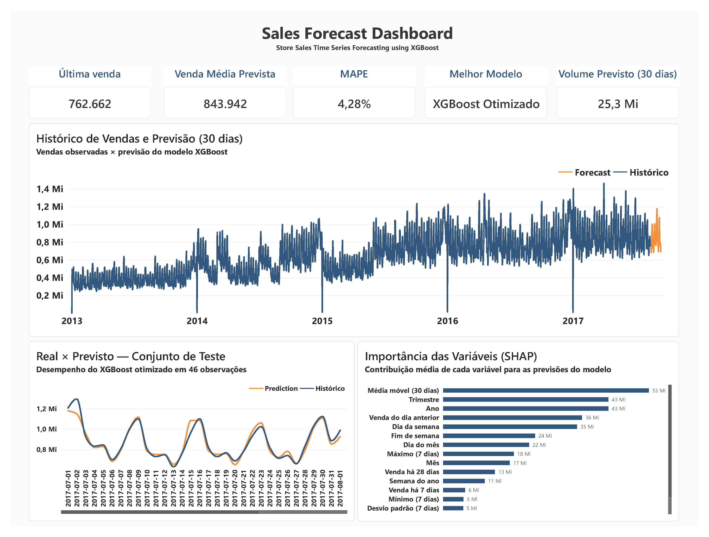

# 📈 Previsão de Vendas com XGBoost e Power BI

Projeto end-to-end de Ciência de Dados para previsão de vendas utilizando séries temporais, Machine Learning, explicabilidade de modelos e Business Intelligence.

O projeto contempla desde a análise exploratória e engenharia de atributos até a comparação de modelos, otimização do XGBoost, interpretação com SHAP, previsão para os próximos 30 dias e desenvolvimento de um dashboard no Power BI.

---

## 🎯 Objetivo

Desenvolver um pipeline de previsão capaz de:

- identificar padrões temporais nas vendas;
- comparar diferentes abordagens de forecasting;
- prever o comportamento das vendas nos próximos 30 dias;
- avaliar quantitativamente o desempenho dos modelos;
- interpretar os fatores que influenciam as previsões;
- apresentar os resultados de forma executiva em Power BI.

---

## 📊 Dashboard

O dashboard desenvolvido no Power BI apresenta:

- última venda observada;
- média de vendas prevista;
- volume total previsto para 30 dias;
- MAPE do melhor modelo;
- histórico de vendas e forecast;
- comparação entre valores reais e previstos;
- importância das variáveis utilizando SHAP.


---

## 🧠 Modelos avaliados

Foram comparadas diferentes estratégias de previsão:

| Modelo | MAPE |
|---|---:|
| **XGBoost Otimizado** | **4,28%** |
| XGBoost | 4,47% |
| Holt-Winters | 7,00% |
| SARIMA | 8,63% |
| Baseline — Persistência | 15,01% |

O **XGBoost otimizado** apresentou o melhor desempenho no conjunto de teste.

---

## ⚙️ Engenharia de atributos

Para representar a dinâmica temporal da série, foram construídas variáveis como:

- Lag 1;
- Lag 7;
- Lag 14;
- Lag 28;
- média móvel de 7 dias;
- média móvel de 30 dias;
- mínimo e máximo móvel;
- desvio padrão móvel;
- dia da semana;
- indicador de fim de semana;
- mês;
- trimestre;
- semana do ano.

---

## 🔍 Explicabilidade do modelo

A biblioteca **SHAP** foi utilizada para analisar a contribuição das variáveis nas previsões do XGBoost.

A abordagem permite identificar quais características temporais exercem maior influência sobre a saída do modelo, aumentando a interpretabilidade da solução.

---

## 🔮 Forecast

O modelo final foi utilizado para gerar uma previsão de vendas para os **30 dias posteriores ao final da série histórica**.

### Principais resultados

- **Modelo final:** XGBoost Otimizado
- **MAPE:** 4,28%
- **Horizonte de previsão:** 30 dias
- **Observações no conjunto de teste:** 46
- **Volume previsto para 30 dias:** aproximadamente 25,3 milhões

---

## 🛠️ Tecnologias utilizadas

- Python
- Pandas
- NumPy
- Scikit-learn
- XGBoost
- SHAP
- Statsmodels
- Matplotlib
- Power BI
- Git
- GitHub

---

## 📁 Estrutura do repositório

```text
sales-forecast-xgboost/
│
├── dashboard/
│   ├── Projeto_Sales_Forecast.pbix
│   ├── Projeto_Sales_Forecast.pdf
│   └── dashboard_preview.png
│
├── notebooks/
│   └── sales_forecast_xgboost.ipynb
│
├── outputs/
│   ├── comparacao_modelos.csv
│   ├── forecast_30d.csv
│   ├── historico_vendas.csv
│   ├── importance_shap.csv
│   └── prediction_test.csv
│
├── .gitignore
└── README.md

## 📊 Dashboard



## 📌 Dados

O projeto utiliza o conjunto de dados Store Sales - Time Series Forecasting, disponibilizado no Kaggle.

Os arquivos brutos não são versionados neste repositório devido ao tamanho e para evitar duplicação da fonte original.

## 🚀 Execução

O fluxo completo da análise está disponível em:

notebooks/sales_forecast_xgboost.ipynb

O notebook contém as etapas de preparação dos dados, análise exploratória, engenharia de atributos, modelagem, avaliação, otimização, SHAP e geração do forecast.

## 👤 Autor

Keltony de Aquino Ferreira

Projeto desenvolvido para portfólio em Ciência de Dados e Analytics.
